# CodeDoc AI - Technical Architecture

## System Overview

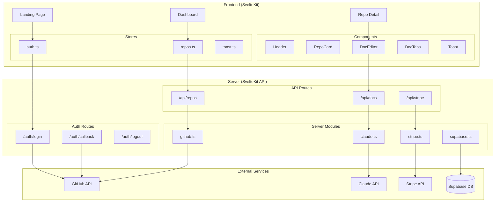

---

## Component Hierarchy

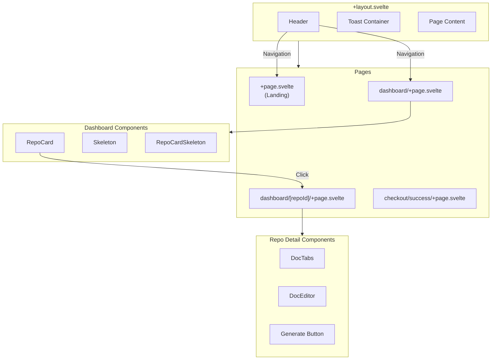

---

## Data Flow Architecture

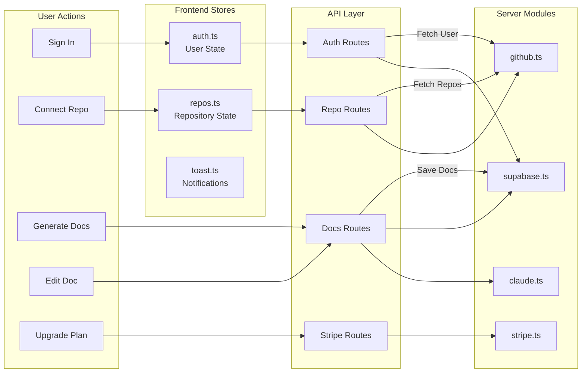

---

## Authentication Flow

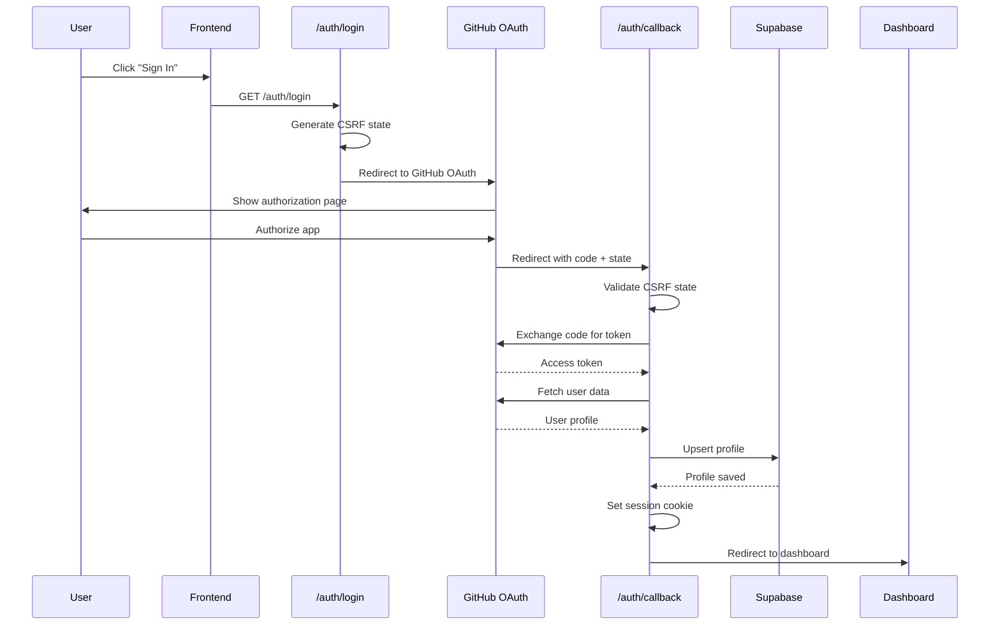

---

## Documentation Generation Flow

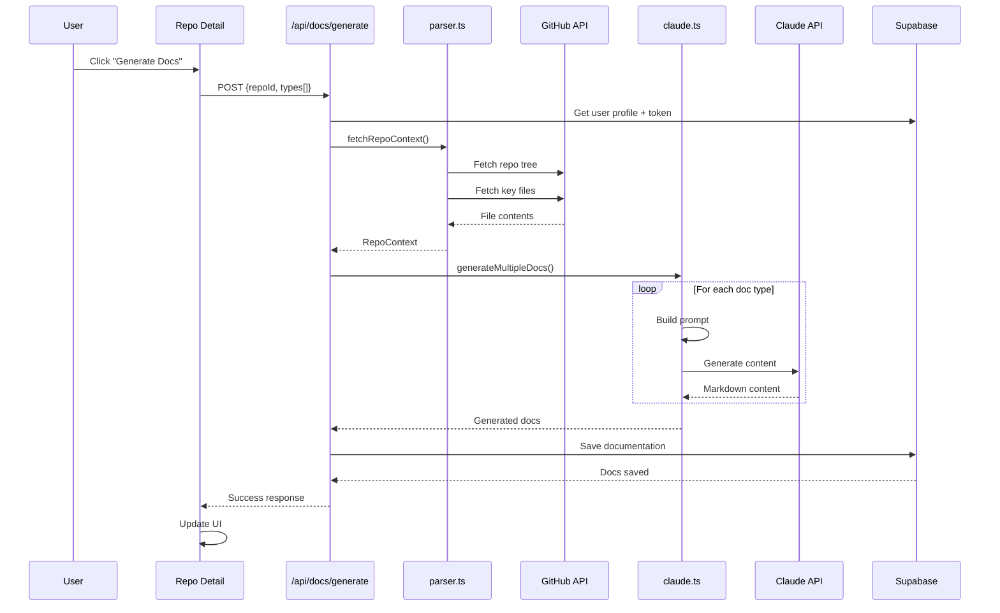

---

## Payment Flow

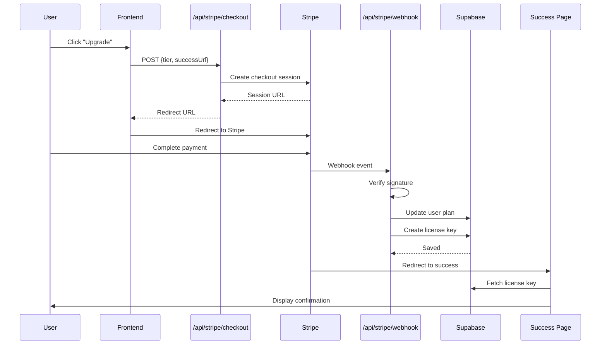

---

## Database Schema

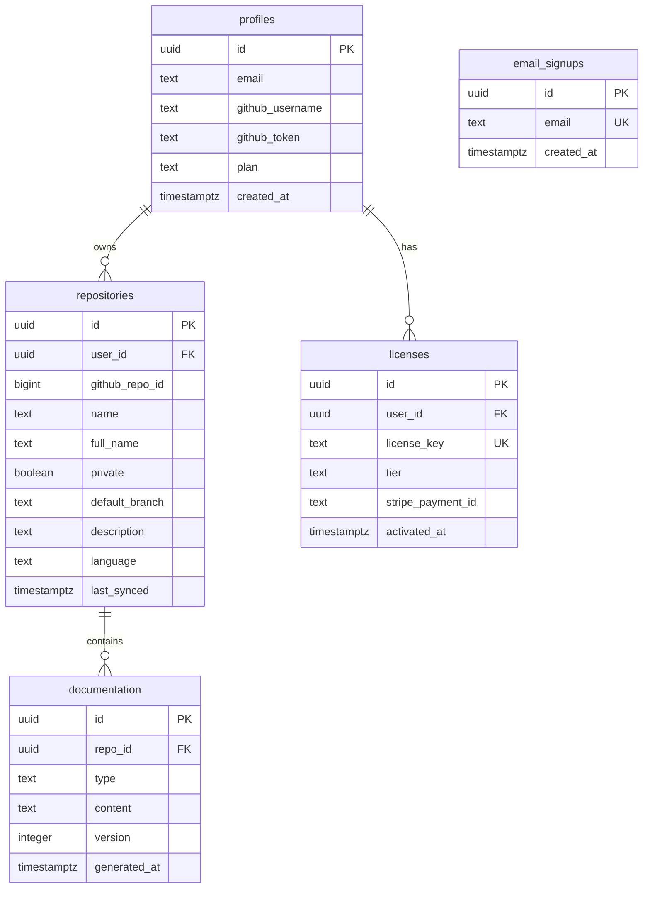

---

## API Endpoints Map

```mermaid
flowchart TD
    subgraph Authentication
        A1["GET /auth/login"]
        A2["GET /auth/callback"]
        A3["POST /auth/logout"]
    end

    subgraph Repositories
        R1["GET /api/repos"]
        R2["POST /api/repos"]
        R3["GET /api/repos/:id"]
        R4["DELETE /api/repos/:id"]
    end

    subgraph Documentation
        D1["POST /api/docs/generate"]
        D2["GET /api/docs/:id"]
        D3["PUT /api/docs/:id"]
        D4["DELETE /api/docs/:id"]
    end

    subgraph Payments
        P1["POST /api/stripe/checkout"]
        P2["POST /api/stripe/webhook"]
    end

    subgraph Other
        O1["POST /api/subscribe"]
    end

    A1 --> |"Initiate OAuth"| GitHub
    A2 --> |"Token Exchange"| GitHub

    R1 --> |"Fetch Repos"| GitHub
    R2 --> |"Save Repo"| Supabase

    D1 --> |"Generate"| Claude
    D1 --> |"Save"| Supabase

    P1 --> |"Create Session"| Stripe
    P2 --> |"Update Plan"| Supabase
```

---

## Store State Management

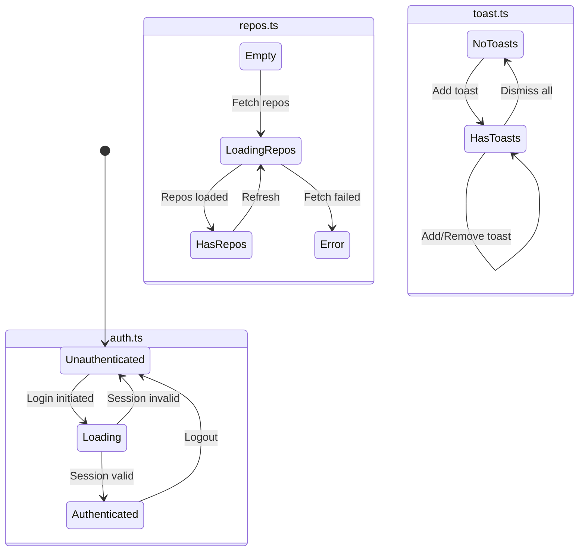

---

## File Structure Overview

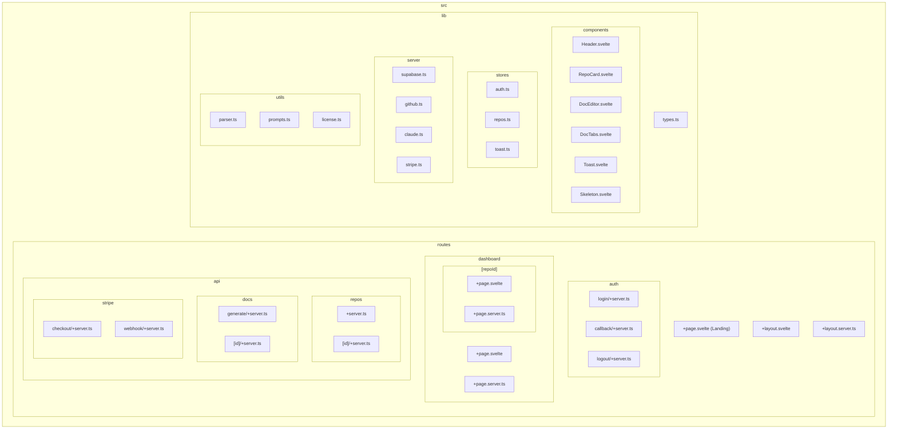

---

## Technology Stack

```mermaid
flowchart TB
    subgraph Frontend
        SK[SvelteKit 2.0]
        TS[TypeScript]
        TW[Tailwind CSS]
        SS[Svelte Stores]
    end

    subgraph Backend
        SKS[SvelteKit Server]
        NJ[Node.js]
    end

    subgraph Database
        SB[Supabase]
        PG[(PostgreSQL)]
        RLS[Row Level Security]
    end

    subgraph External APIs
        GH[GitHub API]
        CL[Claude API]
        ST[Stripe API]
    end

    subgraph Hosting
        VL[Vercel]
        EF[Edge Functions]
    end

    Frontend --> Backend
    Backend --> Database
    Backend --> External APIs
    VL --> Frontend
    VL --> Backend
    SB --> PG
```

---

## Security Architecture

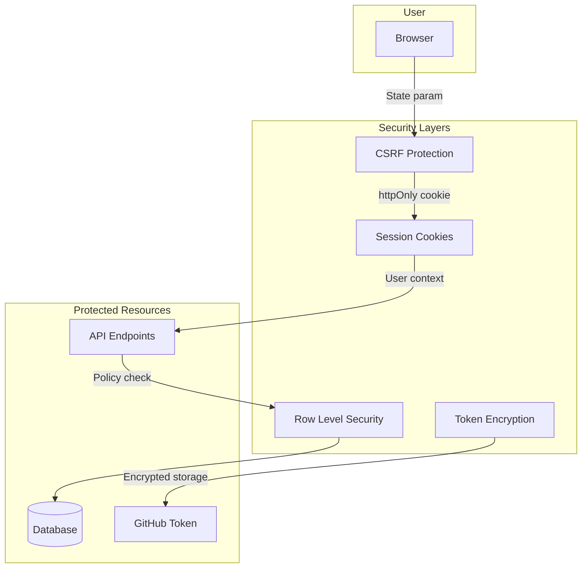

---

## Deployment Architecture

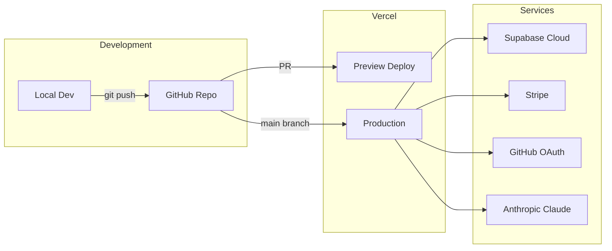

---

## Key Metrics & Limits

| Service | Limit | Notes |
|---------|-------|-------|
| GitHub API | 5,000 req/hr | Per OAuth token |
| Claude API | Varies | Per account tier |
| Stripe | Unlimited | Standard rate limits |
| Supabase | 500MB DB | Free tier |
| Vercel | 100GB bandwidth | Free tier |

---

## Plan-Based Feature Matrix

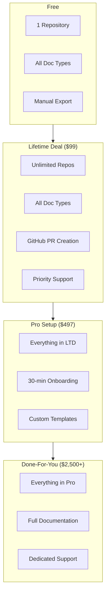
