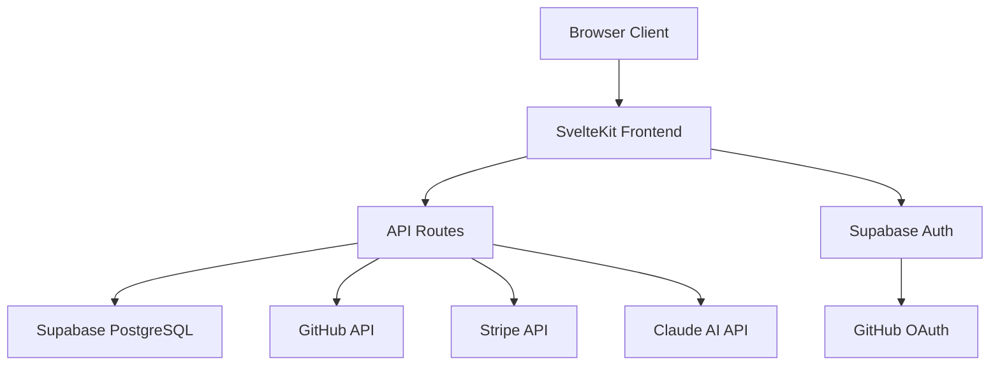

# How AI Is Changing Software Documentation in 2026

**Key Takeaways**

- AI documentation tools can now analyze entire codebases and generate accurate READMEs, API references, architecture diagrams, and setup guides in minutes.
- The shift from "AI writes docs for you" to "AI drafts docs, you refine them" has proven to be the most effective workflow, combining machine speed with human judgment.
- Code-aware AI tools like Codec8 produce significantly better documentation than general-purpose chatbots because they have full context of your project's structure, dependencies, and patterns.
- Documentation debt is becoming a solvable problem. Teams that adopt AI documentation tools report spending 70-80% less time on initial documentation while producing more comprehensive output.

---

Software documentation has always existed in a frustrating paradox. Everyone agrees it is essential. Almost no one wants to write it. The result is millions of GitHub repositories with sparse or outdated docs, internal wikis that have not been updated in years, and onboarding processes that consist of "read the code."

In 2026, AI is finally breaking this deadlock. Not by replacing developers as writers, but by eliminating the blank-page problem and handling the mechanical work of describing code that already exists.

This article examines how AI documentation tools work, what they do well, where they still fall short, and how to integrate them into your workflow today.

---

## What Are AI Documentation Tools?

An AI documentation tool is software that uses large language models (LLMs) to analyze source code and generate human-readable documentation. Unlike generic AI chatbots, purpose-built documentation tools connect directly to codebases -- reading file structures, parsing imports, analyzing function signatures, and understanding architectural patterns -- to produce context-aware documentation.

The category includes several approaches:

1. **Codebase-connected generators** -- Tools like [Codec8](https://codec8.com) that connect to your GitHub repository, analyze the entire project, and generate complete documentation packages (README, API docs, architecture diagrams, setup guides).
2. **Inline doc generators** -- IDE extensions that generate JSDoc, docstrings, or type annotations for individual functions.
3. **Chat-based assistants** -- General-purpose AI chatbots (ChatGPT, Claude) that you paste code into and ask to document.
4. **CI/CD integrations** -- Tools that run in your pipeline and flag undocumented code or auto-generate documentation on each commit.

Each approach has trade-offs. Let us examine what works best.

---

## How Does Code-Aware AI Documentation Work?

The most effective AI documentation tools follow a pipeline that goes far beyond "paste code, get text." Here is what happens when a tool like Codec8 generates documentation for a repository:

### Step 1: Repository Analysis

The tool clones or accesses your repository through the GitHub API and builds a comprehensive map of the project:

- **File tree structure** -- Directories, naming conventions, and organization patterns
- **Package manifest** -- Dependencies, scripts, and metadata from `package.json`, `pyproject.toml`, `go.mod`, etc.
- **Entry points** -- Main files, route handlers, exported functions
- **Configuration files** -- Environment variables, CI/CD configs, Docker files

### Step 2: Code Parsing

The tool reads source files and extracts structured information:

```
Source File: src/routes/api/users/+server.ts
  - Exports: GET, POST, DELETE (RequestHandler)
  - Imports: supabase, json, error
  - Parameters: request, params, cookies
  - Patterns: auth check, database query, JSON response
```

This is fundamentally different from pasting a single file into a chatbot. The AI has the full context of how this file relates to every other file in the project.

### Step 3: Semantic Understanding

The LLM processes the structured data and builds a semantic model of the project:

- What the project does (purpose and value proposition)
- How the components relate to each other (architecture)
- What endpoints or functions are exposed (API surface)
- How to install, configure, and run the project (setup requirements)

### Step 4: Documentation Generation

Using project-specific context and proven documentation templates, the AI generates:

- **README** -- Project overview, features, installation, usage, and contributing guidelines
- **API Documentation** -- Endpoint descriptions, parameters, request/response examples
- **Architecture Diagrams** -- Mermaid diagrams showing component relationships and data flow
- **Setup Guides** -- Step-by-step installation, environment configuration, and development workflow

### Step 5: Human Review

The generated documentation is presented for review, editing, and approval before being committed to the repository or opened as a pull request.

This pipeline is why purpose-built tools produce dramatically better documentation than copying code into a chat window. Context is everything.

---

## What Does AI-Generated Documentation Look Like?

To make this concrete, here is an example. Given a SvelteKit project with Supabase authentication, Stripe payments, and a REST API, a tool like [Codec8](https://codec8.com) might generate an architecture diagram like this:



And an API documentation section like this:

```markdown
## API Endpoints

### POST /api/docs/generate

Generate documentation for a connected repository.

**Request Body:**
| Field | Type | Required | Description |
|-------|------|----------|-------------|
| repoId | string (UUID) | Yes | The connected repository ID |
| types | string[] | Yes | Documentation types: "readme", "api", "architecture", "setup" |

**Response:** 200 OK
| Field | Type | Description |
|-------|------|-------------|
| id | string | Generated documentation ID |
| content | string | Markdown content |
| type | string | Documentation type |
| version | integer | Version number |
```

This level of detail would take a developer 30-60 minutes to write manually. The AI generates it in seconds because it has already parsed the route handlers, request validation, and database schema.

---

## Where Does AI Documentation Excel?

AI documentation tools are strongest in these areas:

### 1. Eliminating the Blank Page

The hardest part of writing documentation is starting. AI removes that barrier entirely by producing a complete first draft that you can edit rather than author from scratch. This psychological shift from "write documentation" to "review and improve documentation" is the single biggest productivity gain.

### 2. Structural Consistency

AI-generated documentation follows consistent formatting, heading structures, and information hierarchies. This is especially valuable for organizations with multiple repositories that should all follow the same documentation standards.

### 3. Coverage Completeness

Humans skip sections they find boring. AI does not. It will document every endpoint, every configuration option, and every environment variable because it processes the entire codebase systematically.

### 4. Keeping Docs in Sync

When code changes, documentation drifts. AI tools can re-analyze the repository and update documentation to reflect the current state of the code. This is one of the most valuable long-term benefits.

### 5. Multilingual Codebases

AI handles polyglot repositories naturally. A project mixing TypeScript, Python, and Go does not require three different documentation tools. The AI understands all three and produces unified documentation.

---

## Where Does AI Documentation Fall Short?

Honesty matters here. AI documentation tools have real limitations:

### 1. Business Context

AI can tell you *what* the code does but not *why* the business decided to build it that way. Product decisions, design trade-offs, and strategic context need to be added by humans.

### 2. Tutorials and Narratives

Step-by-step tutorials that walk users through a real-world workflow require a teaching sensibility that AI does not yet replicate well. AI can generate reference documentation (what each function does), but narrative documentation (how to build a complete feature) still benefits from a human author.

### 3. Edge Cases and Gotchas

The "known issues" and "common pitfalls" sections of documentation come from operational experience. AI cannot know that a particular configuration causes memory leaks in production unless that information exists somewhere in the codebase (comments, issue tracker, etc.).

### 4. Audience Calibration

Different audiences need different documentation. A library's README for end users should differ from its CONTRIBUTING.md for maintainers. AI tends to produce one-size-fits-all documentation unless specifically prompted for different audiences.

---

## What Is the Ideal AI Documentation Workflow?

Based on what works in practice, here is the workflow that produces the best results:

1. **Generate** -- Connect your repository to an AI documentation tool like [Codec8](https://codec8.com) and generate a complete documentation package.

2. **Review** -- Read through the generated documentation. The structure and technical details will be largely accurate. Focus your review on:
   - Is the project description accurate and compelling?
   - Are there business-context sections that need human input?
   - Are the code examples correct and representative?

3. **Enhance** -- Add the human elements that AI cannot provide:
   - Why the project exists (motivation and problem statement)
   - Known limitations and workarounds
   - Links to related resources, community channels, and roadmaps
   - Custom examples based on real user feedback

4. **Commit** -- Push the documentation to your repository or open it as a pull request for team review.

5. **Regenerate** -- When the codebase changes significantly, regenerate the documentation and diff it against the current version. This catches new endpoints, changed configurations, and updated dependencies automatically.

This workflow takes 15-30 minutes instead of 3-5 hours, and the output is typically more comprehensive than what a developer would write manually because the AI covers the entire codebase systematically.

---

## How Does AI Documentation Compare to Manual Writing?

Here is an honest comparison across key dimensions:

| Dimension | AI-Generated | Manually Written |
|-----------|-------------|-----------------|
| Time to first draft | Minutes | Hours to days |
| Coverage completeness | High (systematic) | Variable (depends on motivation) |
| Technical accuracy | High (reads actual code) | High (developer knows intent) |
| Business context | Low (needs human input) | High (developer knows why) |
| Consistency across repos | High (same patterns) | Low (varies by author) |
| Maintenance over time | Regenerate on demand | Often neglected |
| Narrative quality | Functional | Can be excellent |
| Cost | Tool subscription | Developer time |

The clear conclusion is that these approaches are complementary, not competitive. AI handles the 80% of documentation that is mechanical and systematic. Humans contribute the 20% that requires judgment, context, and empathy.

For a look at specific tools in this space, see our comparison of the [best documentation tools for developers in 2026](/blog/best-documentation-tools-developers-2026).

---

## What Is Coming Next for AI Documentation?

Several trends are emerging that will shape AI documentation tools over the next 12-18 months:

### 1. Continuous Documentation

Rather than generating docs as a one-time action, tools will monitor repositories and update documentation automatically when code changes. Imagine a GitHub Action that regenerates your README section for API endpoints whenever a new route handler is merged.

### 2. Interactive Documentation

AI-generated documentation will include interactive elements: runnable code examples, API playgrounds, and conversational help bots that answer questions about specific codebases.

### 3. Documentation Testing

Just as code has tests, documentation will have automated checks. AI tools will verify that documented APIs match actual endpoints, that installation commands work, and that code examples compile and run.

### 4. Multi-Format Output

Current tools generate Markdown. Future tools will output to documentation platforms (Docusaurus, Mintlify, ReadMe), knowledge bases (Notion, Confluence), and even video scripts for walkthrough recordings.

### 5. Community-Sourced Improvements

AI documentation will incorporate feedback from users. When someone opens an issue saying "the setup guide is missing step X," the AI can analyze the issue, verify the gap, and propose an update automatically.

---

## How Can You Get Started with AI Documentation Today?

If you are ready to try AI-powered documentation, here is a practical starting point:

1. **Pick a repository** -- Choose a project that has working code but incomplete documentation. This is where AI provides the most immediate value.

2. **Generate documentation** -- Use [Codec8](https://codec8.com) to connect your GitHub repository and generate a full documentation package: README, API docs, architecture diagrams, and setup guide.

3. **Review and customize** -- Spend 15-20 minutes reviewing the output. Add business context, adjust the project description, and verify code examples.

4. **Commit and iterate** -- Push the documentation and gather feedback from users or team members. Regenerate when the code changes significantly.

5. **Expand to other repos** -- Once you see the time savings on one repository, apply the same workflow across your other projects.

For template inspiration, check out our [GitHub README templates that get stars](/blog/github-readme-templates-that-get-stars) and our [setup guide template for open source projects](/blog/setup-guide-template-open-source).

---

## Frequently Asked Questions

### Will AI replace technical writers?

No. AI documentation tools handle the mechanical, code-derived aspects of documentation: API references, setup instructions, architecture overviews, and structural READMEs. Technical writers add value through narrative documentation, user guides, conceptual explanations, and information architecture -- skills that require human judgment and empathy. The most likely outcome is that technical writers become more productive by using AI for first drafts and focusing their time on the high-judgment work that matters most.

### Is AI-generated documentation accurate enough to trust?

When the AI tool has access to the actual codebase (rather than just a pasted snippet), accuracy is high for structural and reference documentation. The tool reads real function signatures, real route handlers, and real configuration files. Where inaccuracy can creep in is with inferred intent -- the AI might mischaracterize *why* a feature exists even while correctly describing *what* it does. This is why the review step is essential. Think of AI-generated documentation as a highly competent first draft, not a finished product.

### How is Codec8 different from just asking ChatGPT to write my README?

The critical difference is context. When you paste code into a general-purpose chatbot, it sees only the snippet you provide. It cannot see your project structure, dependencies, configuration files, or how different modules interact. [Codec8](https://codec8.com) connects to your full GitHub repository and analyzes the entire codebase before generating documentation. This means it produces accurate API references, correct installation commands, and architecture diagrams that reflect your actual code -- not generic templates. It also outputs multiple documentation types (README, API docs, architecture diagrams, setup guides) in a single generation, whereas a chatbot requires separate prompts for each.

---

## Document Your Code in Minutes, Not Hours

AI documentation tools have reached the point where undocumented code is a choice, not an inevitability. The technology exists to generate professional, comprehensive documentation from any GitHub repository in minutes.

[Try Codec8 free](/try) and generate your first documentation package today. Connect your repo, click generate, and have a complete README, API docs, architecture diagram, and setup guide ready for review.

Visit [codec8.com](https://codec8.com) to get started.
