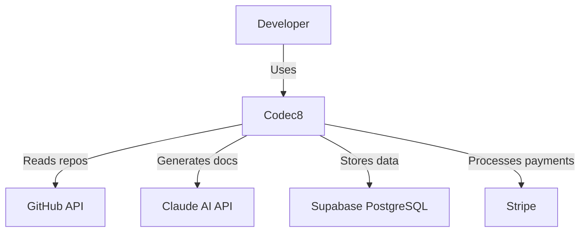
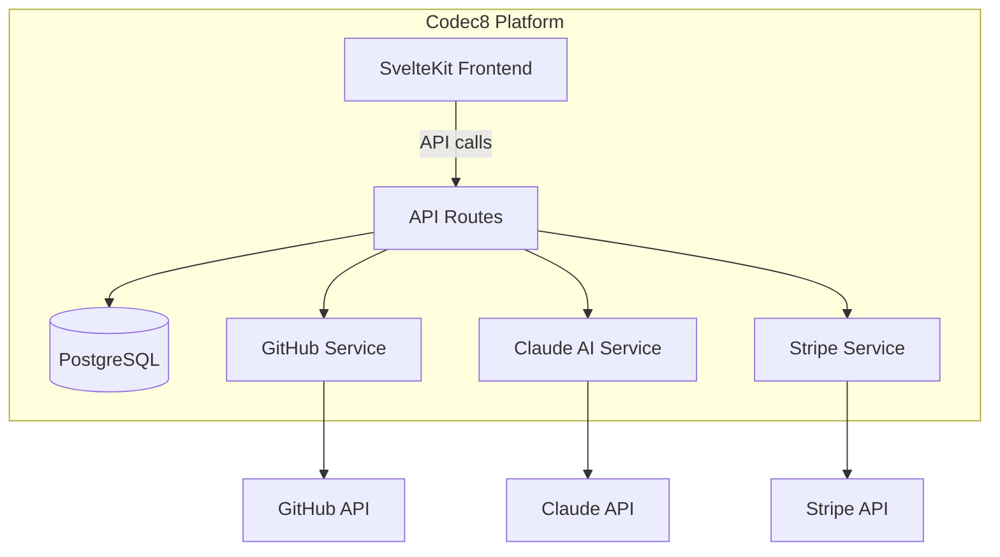
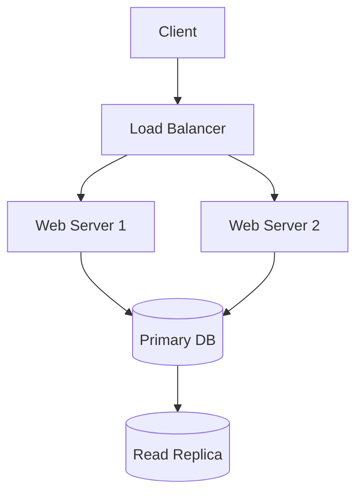
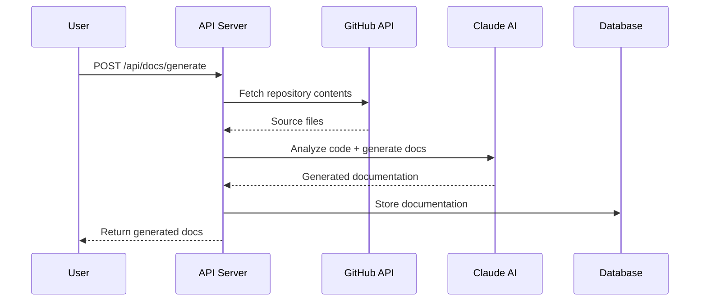
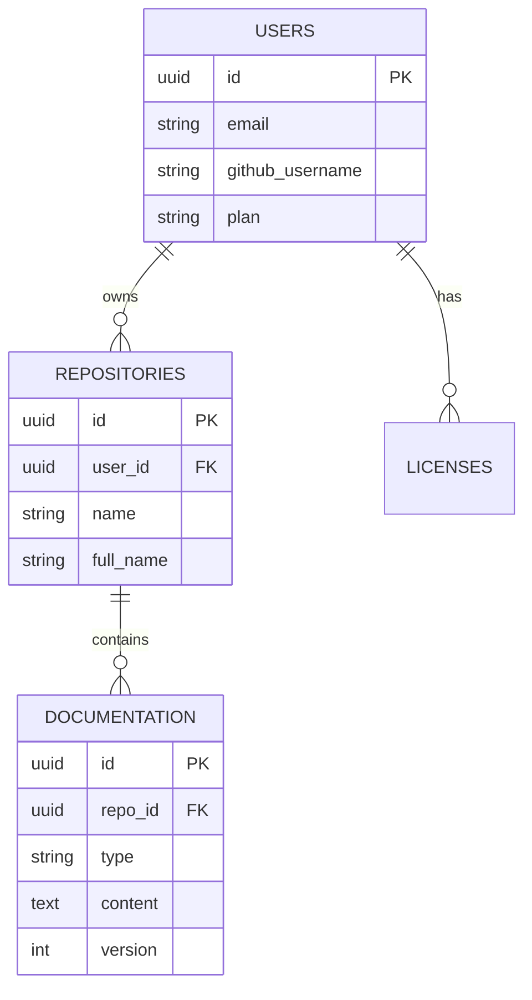
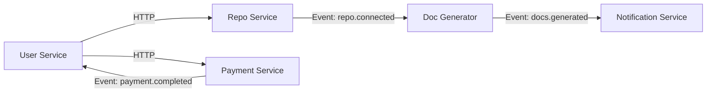

**Key Takeaways (TL;DR)**

- Architecture documentation explains the high-level structure of a system: its components, their relationships, data flow, and the decisions behind the design.
- The C4 model (Context, Container, Component, Code) provides a proven framework for documenting architecture at multiple levels of detail.
- Mermaid diagrams are the most practical format for architecture diagrams in 2026 because they are text-based, version-controlled, and render natively on GitHub.
- Architecture Decision Records (ADRs) capture the "why" behind design choices and prevent teams from relitigating settled decisions.
- AI tools like [Codec8](https://codec8.com) can analyze your codebase and generate architecture diagrams automatically, giving teams an accurate starting point without hours of manual diagramming.

---

**Architecture documentation** is a collection of artifacts -- diagrams, written descriptions, and decision records -- that describe the high-level structure of a software system. It answers fundamental questions: what are the major components? How do they communicate? Where does data flow? What technologies are used and why? Unlike code-level documentation that describes individual functions and classes, architecture documentation explains how the pieces fit together to form a working system.

Every engineering team that has grown beyond three or four people knows the pain of missing architecture documentation. New engineers spend weeks building mental models that could be communicated in a single diagram. Design decisions get revisited because nobody remembers why they were made. Entire subsystems become "that thing only Sarah understands." Architecture documentation solves these problems, but only if it is created effectively and kept current.

## Why Does Architecture Documentation Matter?

Architecture documentation is not academic overhead. It is a practical tool that directly affects engineering velocity, team communication, and system reliability.

1. **Onboarding speed.** A new engineer with access to architecture documentation can become productive in days instead of weeks. They understand the system boundary, the major components, and how data flows before reading a single line of code.

2. **Design communication.** When proposing changes, architects and senior engineers need a shared vocabulary and visual reference. Architecture docs provide this foundation.

3. **Incident response.** During production incidents, understanding the system architecture -- which services depend on which databases, what the failure domains are, where the bottlenecks exist -- is critical for fast resolution.

4. **Technical debt visibility.** Architecture documentation makes technical debt visible. When the diagram shows a tangled web of dependencies, the case for refactoring becomes self-evident.

5. **Compliance and auditing.** Regulated industries require documented system architectures for security audits, SOC 2 compliance, and data flow analysis.

6. **Cross-team coordination.** In organizations with multiple teams, architecture docs clarify ownership boundaries and integration points.

## What Should Architecture Documentation Include?

A complete architecture documentation package includes several complementary artifacts:

### System Context Diagram

The highest-level view. Shows your system as a single box and its relationships with users, external systems, and third-party services.



This diagram answers: "What does the system interact with?"

### Container Diagram

Zooms in one level. Shows the major deployable units (web app, API server, database, message queue) and how they communicate.



### Component Diagram

Zooms in further to show the internal structure of a single container. For example, the internal architecture of your API server: route handlers, middleware, services, and data access layers.

### Architecture Decision Records

Written documents that capture significant design decisions. More on this below.

### Data Flow Diagrams

Show how data moves through the system for specific use cases. Particularly important for systems that process sensitive data.

### Deployment Diagram

Shows the infrastructure: servers, containers, CDNs, load balancers, and their configuration.

## What Is the C4 Model and How Do You Use It?

The **C4 model**, created by Simon Brown, is the most widely adopted framework for software architecture documentation. C4 stands for four levels of abstraction:

### Level 1: System Context

Shows the big picture -- your system and everything it interacts with. Target audience: everyone, including non-technical stakeholders.

**What to include:**
- Your system as a central element
- Users and their roles
- External systems and APIs
- The nature of each relationship (arrows with labels)

**What to exclude:**
- Internal details of your system
- Technology choices
- Databases and infrastructure

### Level 2: Container

Shows the high-level technical building blocks of your system. A "container" in C4 terms is a deployable unit: a web app, a mobile app, a serverless function, a database, a file system.

**What to include:**
- Each deployable/runnable unit
- Technology choices for each container (e.g., "SvelteKit app," "PostgreSQL database")
- Communication protocols between containers (HTTP, gRPC, WebSocket, SQL)
- External system interactions

### Level 3: Component

Shows the internal structure of a single container. Components are the major structural building blocks within a container: controllers, services, repositories, modules.

**What to include:**
- Major components within the container
- Responsibilities of each component
- Interactions between components
- Technology/framework details

### Level 4: Code

The most detailed level, showing classes, interfaces, and functions. This level is usually auto-generated from code (using tools like UML generators) and is only created for the most critical parts of the system.

The practical advice for most teams: always maintain Levels 1 and 2. Create Level 3 for complex or critical containers. Skip Level 4 unless you have a specific need.

## How Do You Create Architecture Diagrams with Mermaid?

Mermaid has become the standard for architecture diagrams in developer-facing documentation. The reasons are compelling:

- **Text-based.** Diagrams are defined in plain text, which means they live in your repository alongside code and are version-controlled.
- **Renders on GitHub.** GitHub natively renders Mermaid diagrams in markdown files, README files, issues, and pull requests.
- **No external tools.** No need for Lucidchart, Draw.io, or Visio licenses.
- **Diffable.** Text-based diagrams produce meaningful diffs in pull requests.

Here are the Mermaid diagram types most useful for architecture documentation:

### Flowcharts for System Architecture



### Sequence Diagrams for Interactions



### Entity Relationship Diagrams



[Codec8](https://codec8.com) generates Mermaid diagrams automatically by analyzing your codebase structure -- reading imports, database schemas, API routes, and service interactions. This gives you an accurate starting diagram that you can refine, rather than staring at a blank canvas trying to remember every service connection.

## What Are Architecture Decision Records (ADRs)?

An **Architecture Decision Record** is a short document that captures a single architectural decision: the context, the decision itself, the alternatives considered, and the consequences.

ADRs solve a common problem: six months from now, someone will ask "why did we use PostgreSQL instead of MongoDB?" or "why are we running two separate services instead of a monolith?" Without ADRs, the answer is "I think Sarah decided that, but she left in October."

### ADR Template

```markdown
# ADR-001: Use PostgreSQL for Primary Data Store

## Status
Accepted

## Date
2026-01-15

## Context
We need a primary database for storing user profiles, repository metadata,
and generated documentation. The data is relational (users own repos,
repos contain docs). We expect moderate read/write volume (thousands of
operations per hour, not millions).

## Decision
We will use PostgreSQL hosted on Supabase.

## Alternatives Considered

### MongoDB
- Pro: Flexible schema for documentation content
- Con: Relational data (user->repo->docs) maps poorly to document model
- Con: No native row-level security

### SQLite
- Pro: Zero operational overhead
- Con: Does not support concurrent writes from multiple serverless functions
- Con: No managed hosting option that fits our architecture

## Consequences

### Positive
- Strong relational model fits our data structure
- Supabase provides managed hosting, auth, and row-level security
- Mature ecosystem with excellent TypeScript support (via Supabase client)

### Negative
- Schema migrations required for data model changes
- Supabase free tier has connection limits we may hit at scale

### Risks
- If documentation content becomes highly variable in structure,
  we may need a JSONB column or supplementary document store
```

### ADR Best Practices

1. **Number them sequentially.** ADR-001, ADR-002, etc.
2. **Keep them immutable.** Once accepted, an ADR is not edited. If a decision changes, create a new ADR that supersedes the old one.
3. **Store them in the repository.** Create a `docs/adr/` directory. They should live with the code they describe.
4. **Write them at decision time.** Not after the fact. The context is freshest when the decision is being made.
5. **Keep them concise.** One to two pages maximum. If an ADR is longer, the decision is probably too broad and should be split.

## How Do You Keep Architecture Documentation Current?

The number one criticism of architecture documentation is that it becomes outdated. Here are proven strategies to prevent this:

### 1. Generate from Code

The most reliable documentation is generated from the source of truth -- the code itself. Tools like [Codec8](https://codec8.com) analyze your actual codebase to produce architecture diagrams, which means regenerating documentation after a refactor takes minutes instead of hours.

This approach is particularly effective for:
- Container and component diagrams (derived from imports and module boundaries)
- Data models (derived from database schemas and ORM definitions)
- API surface documentation (derived from route handlers)

### 2. Embed Diagrams in Code Reviews

When a pull request changes the architecture -- adding a new service, modifying a data flow, introducing a new dependency -- the architecture diagram update should be part of the same PR. Since Mermaid diagrams are text files, they produce readable diffs.

### 3. Schedule Architecture Reviews

Hold a monthly or quarterly "architecture review" meeting where the team walks through the current documentation and identifies what has drifted. This takes 30-60 minutes and catches gaps before they compound.

### 4. Use Lightweight Formats

The lighter the format, the more likely it gets updated. A Mermaid diagram in a markdown file will be updated more frequently than a Visio diagram on a SharePoint server. Optimize for low friction.

### 5. Assign Ownership

Architecture documentation should have an explicit owner -- typically a senior engineer or architect. Ownership does not mean they write everything. It means they ensure the documentation stays current and review contributions from the team.

## How Do You Document Microservice Architectures?

Microservice architectures present unique documentation challenges because the system is distributed across multiple repositories, services, and teams.

### Service Catalog

Maintain a central document listing every service, its purpose, owner, repository, and key endpoints:

| Service | Purpose | Owner | Repository | Port |
|---------|---------|-------|------------|------|
| user-service | User management, auth | Team Alpha | github.com/org/user-svc | 3001 |
| repo-service | Repository management | Team Alpha | github.com/org/repo-svc | 3002 |
| doc-generator | AI doc generation | Team Beta | github.com/org/doc-gen | 3003 |
| payment-service | Stripe integration | Team Gamma | github.com/org/payment-svc | 3004 |

### Inter-Service Communication Map

Document how services communicate -- synchronous (HTTP, gRPC) vs. asynchronous (message queues, events):



### Per-Service Documentation

Each service repository should contain its own documentation. [Codec8](https://codec8.com) can generate per-service documentation by analyzing each repository individually, then you compose the system-level view from these building blocks.

If you are building documentation for individual services, our guide on [how to write a good README](/blog/how-to-write-good-readme) covers the essentials for per-repository documentation.

## What Tools Should You Use for Architecture Documentation?

### Diagramming Tools

- **Mermaid** -- Best for version-controlled diagrams in markdown. Renders on GitHub natively.
- **PlantUML** -- More powerful than Mermaid for complex UML diagrams. Requires a renderer.
- **Structurizr** -- Purpose-built for C4 model diagrams. Supports diagram-as-code.
- **Excalidraw** -- Whiteboard-style diagrams. Good for informal architecture sketches.
- **Draw.io / Diagrams.net** -- Free, full-featured diagramming tool. Files can be stored in Git.

### Documentation Platforms

- **GitHub Wiki** -- Built into every GitHub repo. Good for small teams.
- **Notion** -- Popular for internal documentation. Limited version control.
- **Confluence** -- Enterprise standard. Heavy but feature-rich.
- **Backstage** -- Spotify's open-source developer portal. Excellent for service catalogs.

### AI-Powered Tools

- **[Codec8](https://codec8.com)** -- Generates architecture diagrams, README files, [API documentation](/blog/api-documentation-best-practices), and setup guides from your codebase. The [automated documentation](/blog/document-codebase-automatically-with-ai) approach is particularly valuable for architecture diagrams because it reads the actual import graph and service connections in your code.

### ADR Tools

- **adr-tools** -- CLI for creating and managing ADR files.
- **Log4brains** -- ADR management with a web UI for browsing decisions.

## How Do You Start Documenting an Existing System?

If you are staring at an undocumented system that has been running in production for years, here is a practical approach:

1. **Generate a baseline with AI.** Connect your repositories to [Codec8](https://codec8.com) and generate initial architecture diagrams and documentation. This gives you an 80% accurate starting point in minutes rather than starting from scratch.

2. **Start with Level 1 (System Context).** Draw the simplest possible diagram: your system, its users, and its external dependencies. This takes 15 minutes and provides immediate value.

3. **Add Level 2 (Containers) next.** List every deployable unit, its technology, and how it communicates with other containers. This usually takes 1-2 hours for a medium-complexity system.

4. **Write ADRs going forward.** You cannot reconstruct past decisions with certainty, but you can start capturing decisions from today onward. When someone asks "why do we do X?" and someone knows the answer, write it down as an ADR.

5. **Fill in component diagrams on demand.** When a team member is working on a specific service, have them document its internal architecture. Over time, the most active parts of the system will be documented first -- which is exactly the right prioritization.

6. **Review and iterate.** Schedule a 30-minute review after the first month to assess what is useful and what is missing.

The biggest mistake teams make is trying to document everything at once. Start small, be consistent, and let the documentation grow organically around the areas that matter most.

## Frequently Asked Questions

### How detailed should architecture documentation be?

Follow the "one level of abstraction" rule: each diagram should show one level of detail. If someone wants more detail, they zoom into a lower-level diagram. The C4 model enforces this naturally. For most teams, maintaining Levels 1 (System Context) and 2 (Containers) is sufficient. Add Level 3 (Components) for complex or critical subsystems. Level 4 (Code) is rarely maintained manually -- let your IDE and AI tools handle that level.

### Should architecture diagrams be in a separate wiki or in the repository?

In the repository, whenever possible. Diagrams stored in the repo benefit from version control, code review, and proximity to the code they describe. Mermaid diagrams in markdown files are the ideal format because they render on GitHub and produce meaningful diffs. Reserve wikis and external platforms for cross-repository, system-level documentation that does not belong to any single repository.

### How do you document architecture for a system that changes frequently?

Frequent change makes automated documentation generation essential. If your architecture shifts every sprint, manually maintaining diagrams will always lag behind reality. Use [Codec8](https://codec8.com) to regenerate architecture diagrams from code regularly, and focus your manual documentation effort on the stable elements: system context (which changes rarely), deployment architecture, and ADRs. Accept that component-level diagrams for rapidly evolving services will be approximations, and optimize for "useful enough" rather than "perfectly accurate."

---

Start documenting your system architecture today. [Try Codec8 free](https://codec8.com/try) -- connect your GitHub repository and get an auto-generated architecture diagram, README, API documentation, and setup guide. No more blank-canvas diagramming sessions.
