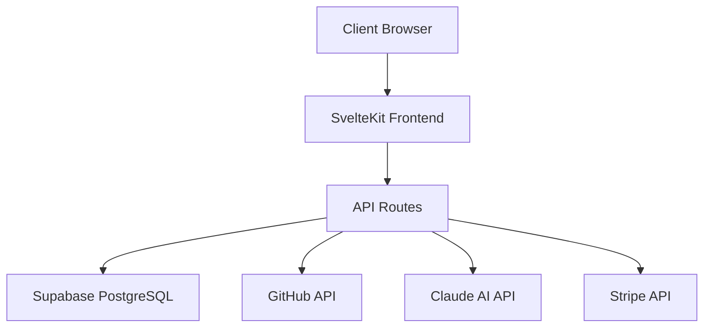

**Key Takeaways (TL;DR)**

- AI documentation generators analyze your source code, dependencies, and project structure to produce README files, API docs, architecture diagrams, and setup guides automatically.
- Manual documentation takes 4-8 hours per project and becomes outdated within weeks. AI generates the same output in minutes and can regenerate whenever your code changes.
- The best AI documentation tools go beyond code comments -- they understand project architecture, infer relationships between modules, and produce human-readable explanations.
- [Codec8](https://codec8.com) connects to your GitHub repository and generates four types of documentation (README, API docs, architecture diagrams, setup guides) from a single codebase analysis.
- AI-generated documentation is a starting point, not a final product. Human review adds context, intent, and narrative that AI cannot infer.

---

An **AI documentation generator** is a software tool that uses artificial intelligence -- typically large language models (LLMs) -- to analyze source code and automatically produce human-readable documentation. Unlike traditional documentation generators that extract formatted comments (like JSDoc or Javadoc), AI documentation generators understand code semantics, infer purpose from implementation, and produce narrative documentation that explains not just what the code does but how its components work together.

The documentation problem in software engineering is well-known: developers hate writing docs, outdated docs are worse than no docs, and the gap between code and documentation widens with every commit. AI documentation generators address this by making documentation generation fast enough to run on every deployment and accurate enough to be genuinely useful.

## Why Is Manual Documentation Failing?

Before exploring the AI solution, it is worth understanding why the traditional approach consistently fails across organizations of every size.

1. **Time cost.** Writing comprehensive documentation for a medium-sized project takes 4-8 hours. For a large codebase with multiple services, it can take days. Developers, understandably, prioritize shipping features.

2. **Immediate obsolescence.** The moment documentation is written, the code continues to evolve. Within weeks, examples stop working, configuration options change, and new endpoints go undocumented.

3. **Knowledge silos.** The developer who wrote the code is usually the only person who can document it accurately. When they leave the team, the documentation either stays frozen or gets rewritten inaccurately.

4. **Inconsistent quality.** Different developers document at different levels of detail. One service has a beautiful README with diagrams. The next has a single line: "TODO: add docs."

5. **Context switching cost.** Writing documentation requires a fundamentally different mental mode than writing code. Switching between the two reduces productivity in both.

These are not problems of discipline or tooling -- they are structural problems with the manual documentation model. AI changes the economics by making documentation generation nearly free in terms of time and effort.

## How Do AI Documentation Generators Work?

Modern AI documentation generators follow a multi-step process to transform code into documentation. Here is how [Codec8](https://codec8.com) and similar tools approach it:

### Step 1: Repository Analysis

The tool connects to your GitHub repository and reads your entire codebase. This includes:

- Source files in all languages
- Package manifests (`package.json`, `requirements.txt`, `Cargo.toml`, etc.)
- Configuration files (`.env.example`, `docker-compose.yml`, CI/CD configs)
- Existing documentation (README, CONTRIBUTING, wiki pages)
- Directory structure and file organization

### Step 2: Code Understanding

The AI model processes the codebase to understand:

- **Project type.** Is this a library, CLI tool, web application, API service, or monorepo?
- **Technology stack.** What frameworks, languages, databases, and services are used?
- **Architecture.** How do modules relate to each other? What are the entry points?
- **API surface.** What endpoints exist? What are their parameters and response types?
- **Configuration.** What environment variables and settings are required?
- **Dependencies.** What external packages are used and why?

### Step 3: Documentation Generation

Based on this analysis, the AI generates structured documentation:

```
Input:  Your GitHub repository
Output: README.md, API reference, architecture diagram, setup guide
```

Each output type serves a different audience and purpose:

- **README** -- Project overview, installation, quick start (for new developers evaluating the project)
- **API Documentation** -- Endpoint reference with parameters, examples, and errors (for integrators)
- **Architecture Diagram** -- Visual representation of system components and data flow (for the team)
- **Setup Guide** -- Step-by-step local development setup (for new team members)

### Step 4: Human Review

The generated documentation is presented for review. You can edit, add context, and customize before publishing. This step is crucial -- AI can describe what the code does, but only you know why it was built this way.

## What Types of Documentation Can AI Generate?

AI documentation generators in 2026 can produce a surprisingly wide range of documentation types. Here are the most valuable:

### README Files

The [README](/blog/how-to-write-good-readme) is the most immediate output. AI excels here because a good README is largely a structured summary of facts that exist in the codebase: what the project is, how to install it, how to use it, and how to configure it.

A README generated by [Codec8](https://codec8.com) typically includes:

- Project description derived from package metadata and code analysis
- Feature list based on exported modules and capabilities
- Installation instructions from package manifests and configuration files
- Quick start examples generated from actual usage patterns in the code
- Configuration reference from environment variables and config schemas
- Technology stack summary

### API Documentation

For web applications and services, AI can identify route handlers, extract parameter validation schemas, and document response formats. This is especially powerful for frameworks with declarative routing like Express, FastAPI, SvelteKit, and Next.js.

```typescript
// Codec8 reads this SvelteKit endpoint...
export const POST: RequestHandler = async ({ request }) => {
  const { email, name, role } = await request.json();
  // validation and business logic...
  return json(user, { status: 201 });
};

// ...and generates documentation for:
// POST /api/users
// Parameters: email (string, required), name (string, required), role (string, optional)
// Response: 201 Created with user object
```

Read our full guide on [API documentation best practices](/blog/api-documentation-best-practices) for more detail on what great API docs look like.

### Architecture Diagrams

AI can generate [architecture documentation](/blog/architecture-documentation-complete-guide) as Mermaid diagrams by analyzing imports, module boundaries, and data flow patterns:



This is particularly valuable because architecture diagrams are the most time-consuming documentation to create manually and the most likely to be out of date.

### Setup Guides

By reading Dockerfiles, docker-compose configurations, package scripts, and environment variable references, AI can generate step-by-step setup guides that actually work.

## How Do You Integrate AI Documentation into Your Workflow?

The most effective way to use AI documentation is not as a one-time generation but as a continuous process integrated into your development workflow.

### Approach 1: Generate on Demand

The simplest approach. When you need documentation, connect your repo to [Codec8](https://codec8.com) and generate it.

**Best for:** Open-source projects, portfolio projects, and one-time documentation needs.

### Approach 2: Generate on Release

Add documentation generation to your release process. Before each release, regenerate docs to ensure they match the current codebase.

```yaml
# Example GitHub Actions workflow
name: Generate Docs
on:
  release:
    types: [published]
jobs:
  docs:
    runs-on: ubuntu-latest
    steps:
      - uses: actions/checkout@v4
      - name: Generate documentation
        run: |
          # Trigger Codec8 documentation generation
          curl -X POST https://codec8.com/api/generate \
            -H "Authorization: Bearer ${{ secrets.CODEC8_API_KEY }}" \
            -d '{"repo": "${{ github.repository }}"}'
```

**Best for:** Libraries and APIs where documentation accuracy is critical at release time.

### Approach 3: Generate on Every PR

The most thorough approach. Documentation is regenerated or validated on every pull request, ensuring that code changes and documentation changes stay in sync.

**Best for:** Teams with strict documentation requirements or compliance needs.

### Approach 4: Scheduled Regeneration

Set up weekly or monthly documentation regeneration to catch drift without the overhead of per-PR generation.

**Best for:** Internal services and microservices where documentation is important but not release-blocking.

## What Should You Look for in an AI Documentation Tool?

Not all AI documentation tools are equal. Here are the criteria that matter:

1. **Code analysis depth.** Does the tool actually read and understand your code, or does it just process file names and comments? [Codec8](https://codec8.com) analyzes the full source code, including function implementations, type definitions, and import relationships.

2. **GitHub integration.** Seamless connection to your repositories is essential. You should not need to upload files manually or configure complex CI pipelines just to generate docs.

3. **Multiple output types.** A tool that only generates READMEs solves one problem. A tool that generates READMEs, API docs, architecture diagrams, and setup guides solves the documentation problem comprehensively.

4. **Accuracy.** The generated documentation must be factually correct. Inaccurate documentation is worse than no documentation because developers will waste time following wrong instructions.

5. **Customization.** You should be able to edit the output, set documentation style preferences, and control what gets documented.

6. **Freshness.** The tool should make it easy to regenerate documentation as your code evolves, not just generate it once.

7. **Security.** Your code is your intellectual property. The tool should explain how it handles your source code and whether it stores or trains on it.

## How Does AI Documentation Compare to Traditional Approaches?

Here is a practical comparison of documentation approaches across key dimensions:

| Dimension | Manual Writing | Comment-Based (JSDoc, etc.) | AI-Generated (Codec8) |
|-----------|---------------|----------------------------|----------------------|
| Time to create | 4-8 hours | 1-2 hours (comments) | Under 5 minutes |
| Accuracy | High (initially) | Medium (comments drift) | High (reads current code) |
| Completeness | Varies by author | Limited to commented code | Comprehensive |
| Maintenance cost | High | Medium | Low (regenerate) |
| Architecture docs | Manual diagram creation | Not supported | Auto-generated |
| Setup guides | Manual writing | Not supported | Auto-generated |
| Consistency | Varies | Template-enforced | Consistently structured |

The key insight is that AI documentation and manual documentation are not mutually exclusive. The optimal workflow uses AI to generate the factual foundation -- what the code does, how to install it, what the API looks like -- and human writing to add the narrative layer: why the project exists, what design decisions were made, and what the roadmap looks like.

## What Are the Limitations of AI Documentation?

Honest assessment of limitations is important for setting correct expectations:

1. **Intent and motivation.** AI can describe what code does but cannot reliably explain why it was written that way. Design decisions, trade-offs, and historical context require human input.

2. **Business context.** AI does not know your product roadmap, customer use cases, or organizational priorities. Documentation aimed at non-technical stakeholders needs human writing.

3. **Undocumented conventions.** If your team has unwritten rules ("we always use repository pattern for data access"), AI will not know to document them unless they are evident in the code.

4. **Edge cases and gotchas.** Those subtle bugs that only appear under specific conditions, or the workaround you had to implement because of a third-party limitation -- these require human annotation.

5. **Tone and voice.** AI-generated documentation tends toward neutral technical writing. If your brand has a specific voice (casual, formal, humorous), you will need to adjust the output.

The practical takeaway: use AI for the 80% of documentation that is factual and structural, then invest human effort in the 20% that requires context, intent, and narrative.

## How Do You Evaluate the Quality of AI-Generated Documentation?

After generating documentation, review it against these criteria:

1. **Factual accuracy.** Do the installation instructions actually work? Are the API endpoints correct? Do the configuration options match reality?

2. **Completeness.** Are all public APIs documented? Are all required environment variables listed? Is every setup step included?

3. **Clarity.** Can a developer who has never seen the project understand it from the documentation alone?

4. **Code example validity.** Copy-paste every code example and run it. If it does not work, it needs to be fixed.

5. **Structure and navigation.** Can a developer find what they need in under 10 seconds?

Run through these checks after every generation. Over time, as you train your eye for what needs human enhancement, the review process becomes faster.

## How Is AI Documentation Evolving in 2026?

The capabilities of AI documentation tools are expanding rapidly. Here is what is emerging:

- **Multi-repository understanding.** Tools are beginning to document relationships between microservices, not just individual repositories.
- **Interactive documentation.** AI-generated docs with embedded, runnable code examples that developers can modify and execute in the browser.
- **Continuous documentation monitoring.** Tools that detect when code changes have made documentation inaccurate and automatically flag or regenerate affected sections.
- **Natural language querying.** Instead of searching documentation, developers ask questions in natural language and get answers grounded in the codebase.

[Codec8](https://codec8.com) is building toward this future, starting with the foundation: accurate, comprehensive documentation generated from your actual code, available whenever you need it.

## Frequently Asked Questions

### Will AI documentation replace technical writers?

No. AI documentation generators handle the factual, structural layer of documentation -- what the API does, how to install the project, what configuration options exist. Technical writers add the human layer: tutorials, conceptual guides, user journeys, and narrative documentation. The most effective documentation strategy in 2026 uses AI to eliminate the tedious parts of documentation so technical writers can focus on the high-value content that requires human insight.

### How accurate is AI-generated documentation?

When the AI has access to the actual source code (not just file names or comments), accuracy is high for factual content like API endpoints, parameters, installation steps, and configuration options. [Codec8](https://codec8.com) reads your full codebase, which means it generates documentation based on what the code actually does rather than what comments claim it does. However, you should always review the output -- particularly descriptions of purpose and behavior -- before publishing.

### Can AI document legacy codebases with no existing documentation?

This is actually one of the strongest use cases for AI documentation. Legacy codebases that have zero documentation benefit enormously from AI analysis because the alternative is spending days reading unfamiliar code to understand it. AI can process the entire codebase, identify the technology stack, map the architecture, and produce a comprehensive starting document in minutes. This is particularly valuable during onboarding, acquisitions, or when taking over maintenance of an inherited project.

---

Ready to stop writing documentation manually? [Try Codec8 free](https://codec8.com/try) -- connect your GitHub repository and generate a complete README, API documentation, architecture diagram, and setup guide in under a minute. Focus on building. Let AI handle the docs.
